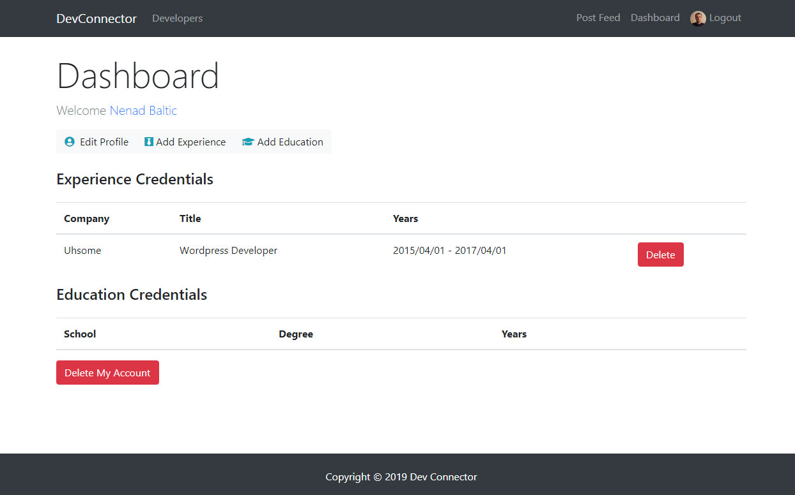
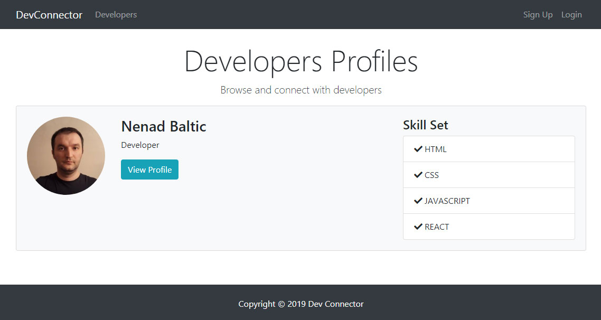

# Devconnector App

Devconnector app I built as a part of [MERN Stack Front To Back: Full Stack React, Redux & Node.js](https://www.udemy.com/mern-stack-front-to-back).

## [Live demo](https://react-node-devconnector.herokuapp.com)

## Features:
- Ability to create an account
- Ability to create a profile 
- Adding experience to own profile
- Adding education to own profile
- Adding posts
- Adding comments to posts

## Screenshots:
Dashboard Page:

Profiles Page:

